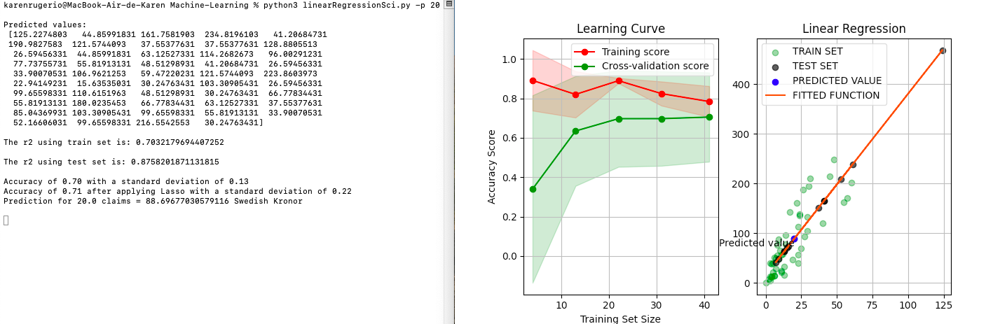

# Linear Regression using Scikit learn

```console
pip3 install pandas
pip3 install -U scikit-learn
pip3 install numpy
pip3 install -U matplotlib
``` 

## Dataset

> Swedish Committee on Analysis of Risk Premium in Motor Insurance
http://college.hmco.com/mathematics/brase/understandable_statistics/7e/students/datasets/
       slr/frames/frame.htmlownlee/Datasets/blob/master/auto-insurance.csv

x = number of claims.

y = total payment for all the claims in thousands Swedish Kronor (Swedish currency).

## Running the model

**The flag -p is needed to supply the x (number of claims) value for the y (total payment for all the claims in thousands Swedish Kronor [Swedish currency]) to be calculated**

#### Example to predict the payment of 20 claims
 
```console
user@system:~% python3 linearRegressionSci.py -p 20

```

### Results



[Report](./ModelAnalysis-LinearRegression.pdf)
